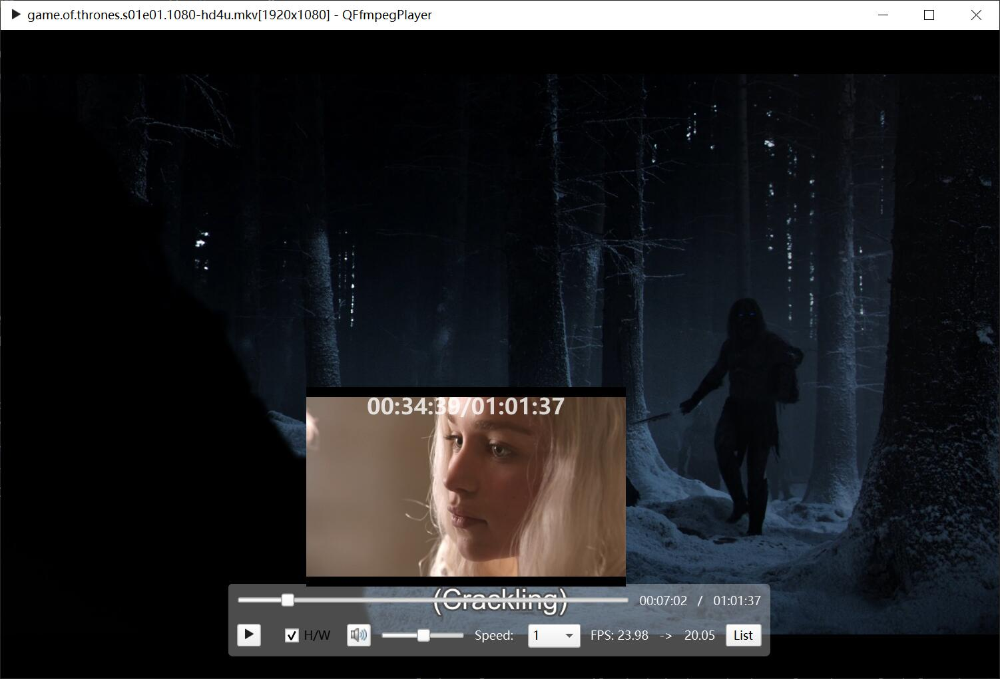
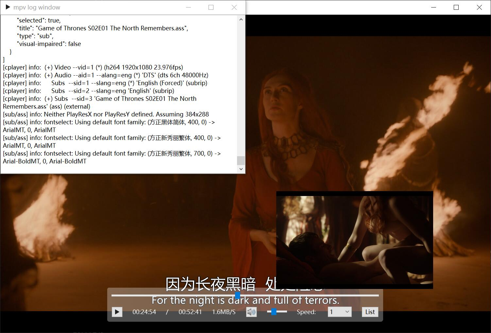

# Qt-Media

-   [Simplified Chinese](README.md)
-   [English](README.en.md)

**This is an audio and video project based on Qt, FFmpeg and mpv, integrating a player and transcoder.**

## Ffmpeg Player

<div align=center>

</div>

### Requires a powerful opengl and vulkan yuv rendering module

-   Opengl's fragment shader currently supports limited image formats;
-   在WidgetRender中，尽可能使用QImage::Format_RGB32和QImage::Format_ARGB32_Premultiplied图像格式。如下原因：
    -   Avoid most rendering directly to most of these formats using QPainter. Rendering is best optimized to the Format_RGB32  and Format_ARGB32_Premultiplied formats, and secondarily for rendering to the Format_RGB16, Format_RGBX8888,  Format_RGBA8888_Premultiplied, Format_RGBX64 and Format_RGBA64_Premultiplied formats.

### AVFrame image adjustment

-   according to`AVColorSpace`Perform color space conversion;
-   according to`AVColorTransferCharacteristic`Make adjustments to gamma, PQ, HLG, etc.;
-   according to`AVColorPrimaries`Perform color gamut conversion;
-   according to`AVColorRange`Make color range adjustments;

#### opengl 渲染的情况下，该怎么样修改shader？

-   reference[MPV video_shaders](https://github.com/mpv-player/mpv/blob/master/video/out/gpu/video_shaders.c)；

#### In the case of non-opengl rendering, how to add a filter to achieve image compensation?

```bash
zscale=p=709;
```

### How to achieve image quality enhancement when rendering images with OpenGL?

### Ffmpeg (5.0) decodes subtitles differently from 4.4.3

#### Decode subtitles (ffmpeg-n5.0)

```bash
0,,en,,0000,0000,0000,,Peek-a-boo!
```

you have to use`ass_process_chunk`and set pts and duration, and in[vf_subtitles.c](https://github.com/FFmpeg/FFmpeg/blob/master/libavfilter/vf_subtitles.c#L490)Same as in.

#### The ASS standard format should be (ffmpeg-n4.4.3)

```bash
Dialogue: 0,0:01:06.77,0:01:08.00,en,,0000,0000,0000,,Peek-a-boo!\r\n
```

use`ass_process_data`;

### Issue with subtitle display timing when using subtitle filter

```bash
subtitles=filename='%1':original_size=%2x%3
```

## Ffmpeg Transcoder

**How to set encoding parameters to get smaller files and better video quality?**

-   reference[HandBrake encavcodec](https://github.com/HandBrake/HandBrake/blob/master/libhb/encavcodec.c#L359)

### 如何从AVAudioFifo获取的帧中计算pts？

```C++
// fix me?
frame->pts = transcodeCtx->audioPts / av_q2d(transcodeCtx->decContextInfoPtr->timebase())
                     / transcodeCtx->decContextInfoPtr->codecCtx()->sampleRate();
transcodeCtx->audioPts += frame->nb_samples;
```

-   [New BING’s video transcoding recommendations](./doc/bing_transcode.md)
-   SwsContext is great! Compared to QImage Convert to and Scale\*\*

## Mpv Player

<div align=center>

</div>

-   When using 4K video in the preview window, it will occupy a lot of memory because an additional mpv instance is opened and the memory is double;

-   MacOS seems to only be able to use[QOpenglWidget](https://github.com/mpv-player/mpv-examples/tree/master/libmpv/qt_opengl)rendering;

    ```shell
    [vo/gpu] opengl cocoa backend is deprecated, use vo=libmpv instead
    ```

    But use`vo=libmpv`The video cannot be displayed normally either;

    Using opengl version greater than 3 has better performance;

    ```cpp
    QSurfaceFormat surfaceFormat;
    surfaceFormat.setVersion(3, 3);
    surfaceFormat.setProfile(QSurfaceFormat::CoreProfile);
    QSurfaceFormat::setDefaultFormat(surfaceFormat);
    ```

    > **Note:**When setting Qt::AA_ShareOpenGLContexts, it is strongly recommended to place the call to this function before the construction of the QGuiApplication or QApplication. Otherwise format will not be applied to the global share context and therefore issues may arise with context sharing afterwards.

-   It seems that it can only be used under Ubuntu[QOpenglWidget](https://github.com/mpv-player/mpv-examples/tree/master/libmpv/qt_opengl)rendering

    ```shell
    qt.dbus.integration: Could not connect "org.freedesktop.IBus" to globalEngineChanged(QString)
    ```

-   MacOS packaging requirements[install_name_tool](/mac/change_lib_dependencies.rb), the dependency copy script file comes from[there](https://github.com/iina/iina/blob/develop/other/change_lib_dependencies.rb)；

    **current`brew`installed`mpv`middle,`libmpv.dylib`The dependency is`@loader_path/`, so some modifications were made to the script;**

    ```shell
    ./mac/change_lib_dependencies.rb "$(brew --prefix)" "$(brew --prefix mpv)/lib/libmpv.dylib"
    ```

Dependencies will be copied to`packet/Qt-Mpv.app/Contents/Frameworks/`；

# QPlayer

-   reference[Media Player Example](https://doc.qt.io/qt-6/qtmultimedia-player-example.html)

## QT-BUG

-   动态切换Video Render，从opengl切换到widget，还是有GPU 0-3D占用，而且使用量是opengl的2倍！！！QT-BUG？

-   QOpenGLWidget内存泄漏，移动放大和缩小窗口，代码如下

    ```C++
    int main(int argc, char *argv[])
    {
        QApplication a(argc, argv);
        MainWindow w;
        w.show();
        return a.exec();
    }

    MainWindow::MainWindow(QWidget *parent)
        : QMainWindow(parent)
    {
        setCentralWidget(new QOpenGLWidget(this));
    }

    ```
