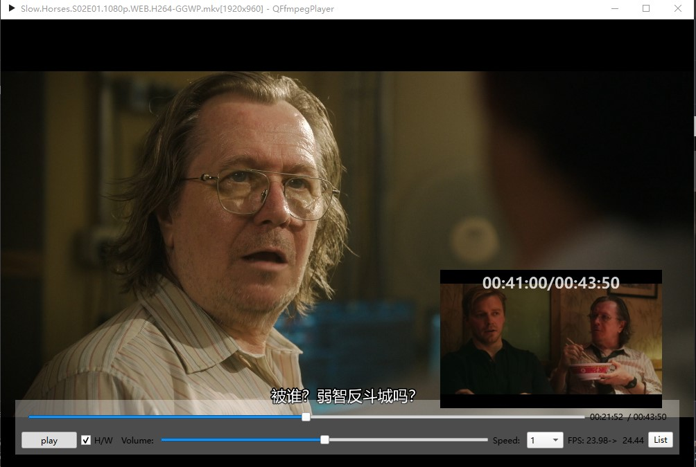

# Qt-Ffmpeg

- [简体中文](README.md)
- [English](README.en.md)

## QFfmpegPlayer

<div align=center></div>

### 需要一个强大的opengl和vulkan yuv渲染模块！

1. Opengl中的shader有太多if else导致GPU空跑，影响GPU解码和av_hwframe_transfer_data速度，这个现象在4K视频图像上尤为明显；
2. 在WidgetRender中，尽可能使用QImage::Format_RGB32和QImage::Format_ARGB32_Premultiplied图像格式。如下原因：
   1. Avoid most rendering directly to most of these formats using QPainter. Rendering is best optimized to the Format_RGB32  and Format_ARGB32_Premultiplied formats, and secondarily for rendering to the Format_RGB16, Format_RGBX8888,  Format_RGBA8888_Premultiplied, Format_RGBX64 and Format_RGBA64_Premultiplied formats.

### ``avformat_seek_file``，当seek的时间点小于当前时间点一些时，比如-5秒、-10秒，seek不到目标时间点

#### 有一种解决方法是：先``seek``到0秒，再``seek``到目标时间点。  
这个时候-5秒、-10秒的seek，效果非常好，比之前好很多，之前有时候会卡在当前时间点，无法seek到目标时间点。

```C++
formatCtx->seek(0);
formatCtx->seek(position);
```

### Ffmpeg（5.0）在解码字幕与4.4.3不太一样

### 解码字幕(ffmpeg-n5.0):

```
0,,en,,0000,0000,0000,,Peek-a-boo!
```

你必须使用 ``ass_process_chunk`` 并设置 pts 和持续时间, 如在 libavfilter/vf_subtitles.c 中一样。

ASS 标准格式应为(ffmpeg-n4.4.3) :

```
Dialogue: 0,0:01:06.77,0:01:08.00,en,,0000,0000,0000,,Peek-a-boo!\r\n
```

使用 ``ass_process_data``;

### 使用字幕过滤器时，字幕显示时间有问题

```
subtitles=filename='%1':original_size=%2x%3
```

## QFfmpegTranscoder

如何设置编码参数以获得更小的文件和更好的视频质量？

1. 设置非常高的比特率;
2. 设置编码器 ``global_quality`` 无效。代码如下：

   ```C++
   d_ptr->codecCtx->flags |= AV_CODEC_FLAG_QSCALE;
   d_ptr->codecCtx->global_quality = FF_QP2LAMBDA * quailty;
   ```
3. 设置 ``crf`` 无效。代码如下：

   ```C++
   av_opt_set_int(d_ptr->codecCtx, "crf", crf, AV_OPT_SEARCH_CHILDREN);
   ```

### 如何从AVAudioFifo获取的帧中计算pts？

```C++
// fix me?
frame->pts = transcodeCtx->audioPts / av_q2d(transcodeCtx->decContextInfoPtr->timebase())
                     / transcodeCtx->decContextInfoPtr->codecCtx()->sampleRate();
transcodeCtx->audioPts += frame->nb_samples;
```

### [New BING的视频转码建议](./doc/bing_transcode.md)

## SwsContext很棒！与 QImage 转换为和缩放相比。

## QT-BUG

### Failed to set up resampler

[it&#39;s a bug in Qt 6.4.1 on Windows](https://forum.qt.io/topic/140523/qt-6-x-error-message-qt-multimedia-audiooutput-failed-to-setup-resampler)
https://bugreports.qt.io/browse/QTBUG-108383 (johnco3's bug report)
https://bugreports.qt.io/browse/QTBUG-108669 (a duplicate bug report; I filed it before I found any of this)

#### solution:

https://stackoverflow.com/questions/74500509/failed-to-setup-resampler-when-starting-qaudiosink

#### 动态切换Video Render，从opengl切换到widget，还是有GPU 0-3D占用，而且使用量是opengl的2倍！！！QT-BUG？

### QOpenGLWidget内存泄漏，移动放大和缩小窗口，代码如下：

```C++
int main(int argc, char *argv[])
{
    QApplication a(argc, argv);
    MainWindow w;
    w.show();
    return a.exec();
}

MainWindow::MainWindow(QWidget *parent)
    : QMainWindow(parent)
{
    setCentralWidget(new QOpenGLWidget(this));
}

```
