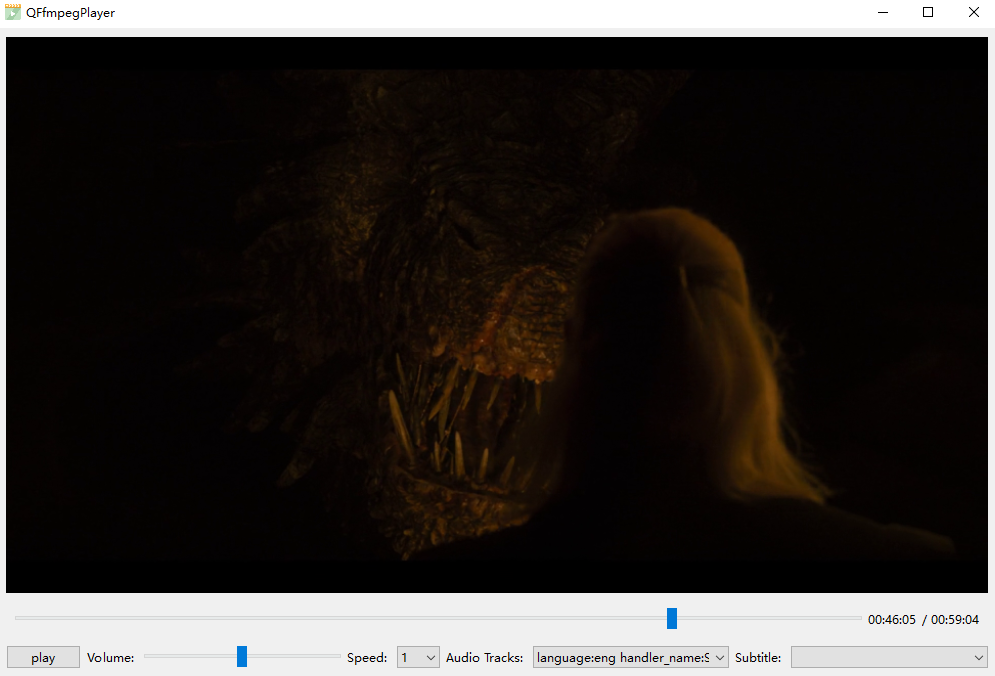

# Qt-Ffmpeg

## Requires a robust opengl and vulkan yuv rendering module!

1. Opengl渲染会影响GPU解码和av_hwframe_transfer_data速度，可能是频繁拷贝内存导致的（GPU->CPU，CPU->GPU），这个现象在4K视频图像上尤为明显；
   1. opengl不渲染，帧率正常；
   2. opengl渲染，解码和拷贝会变慢，需要丢帧，帧率会下降，如果还有字幕图像，帧率就更低了；
   3. 可能需要D3D这种直接显示，不需要把图像从显存拷贝到内存，但是这个方案不能跨平台；
   4. 又或者使用vulkan，共享内存？
2. 在WidgetRender中，尽可能使用QImage::Format_RGB32和QImage::Format_ARGB32_Premultiplied图像格式。如下原因：
   1. Avoid most rendering directly to most of these formats using QPainter. Rendering is best optimized to the Format_RGB32  and Format_ARGB32_Premultiplied formats, and secondarily for rendering to the Format_RGB16, Format_RGBX8888,  Format_RGBA8888_Premultiplied, Format_RGBX64 and Format_RGBA64_Premultiplied formats.

## SwsContext is awesome! Compared to QImage convertTo and scaled.

## How to set the encoding parameters to get smaller file size and better quality video?

1. Set a very high bit rate;
2. Setting encoder global_quality is invalid.The code is as follows:

   ```C++
   d_ptr->codecCtx->flags |= AV_CODEC_FLAG_QSCALE;
   d_ptr->codecCtx->global_quality = FF_QP2LAMBDA * quailty;
   ```
3. Setting crf is invalid. The code is as follows：

   ```C++
   av_opt_set_int(d_ptr->codecCtx, "crf", crf, AV_OPT_SEARCH_CHILDREN);
   ```

## How to compute pts from frames taken from AVAudioFifo?

```C++
// fix me?
frame->pts = transcodeCtx->audioPts * 1000
                     / transcodeCtx->decContextInfoPtr->codecCtx()->sampleRate();
transcodeCtx->audioPts += frame->nb_samples;
```

## QFfmpegPlayer

<div align=center></div>

### 动态切换Video Render，从opengl切换到widget，还是有GPU 0-3D占用，而且使用量是opengl的2倍！！！QT-BUG？

## QOpenGLWidget memory leak, move zoom-in and zoom-out window, code as follows:

```C++
int main(int argc, char *argv[])
{
    QApplication a(argc, argv);
    MainWindow w;
    w.show();
    return a.exec();
}

MainWindow::MainWindow(QWidget *parent)
    : QMainWindow(parent)
{
    setCentralWidget(new QOpenGLWidget(this));
}

```
