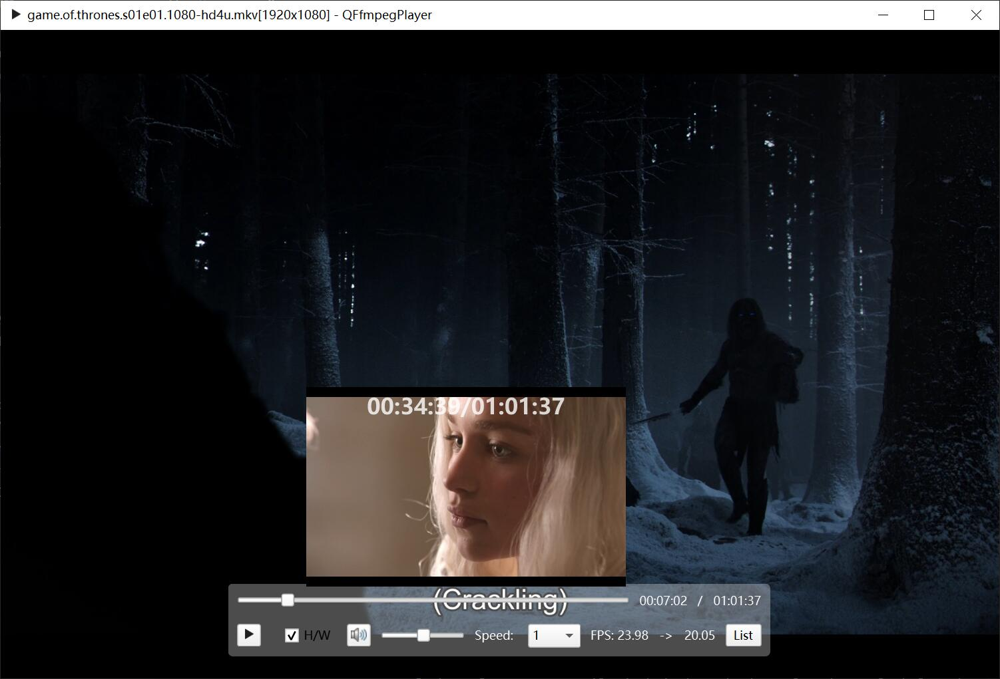
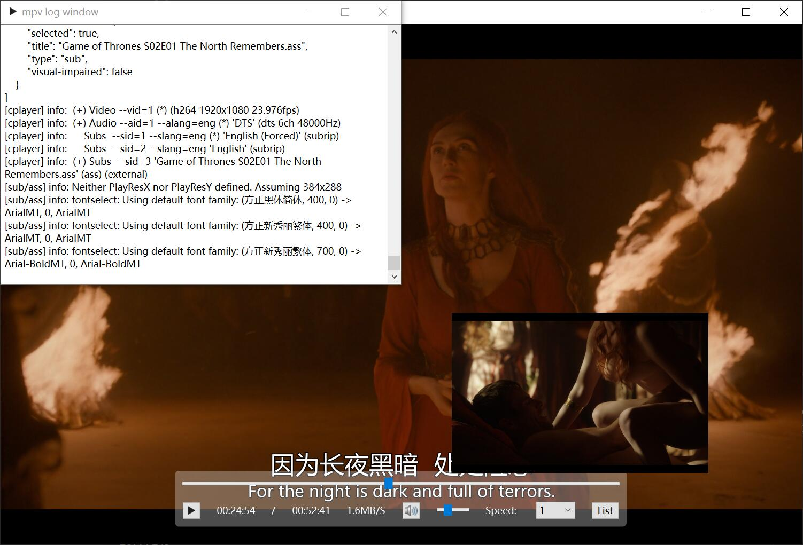

# Qt-Media

- [简体中文](README.md)
- [English](README.en.md)

**这是一个基于Qt、FFmpeg和mpv的音视频项目，集成了播放器和转码器。**

## Ffmpeg Player

<div align=center>

</div>

### 需要一个强大的opengl和vulkan yuv渲染模块

- Opengl的片段着色器目前支持的图像格式有限；
- 在WidgetRender中，尽可能使用QImage::Format_RGB32和QImage::Format_ARGB32_Premultiplied图像格式。如下原因：
  - Avoid most rendering directly to most of these formats using QPainter. Rendering is best optimized to the Format_RGB32  and Format_ARGB32_Premultiplied formats, and secondarily for rendering to the Format_RGB16, Format_RGBX8888,  Format_RGBA8888_Premultiplied, Format_RGBX64 and Format_RGBA64_Premultiplied formats.

### AVFrame 图像调整

- 根据`AVColorSpace`进行色彩空间转换；
- 根据`AVColorTransferCharacteristic`进行gamma、PQ、HLG等调整;
- 根据`AVColorPrimaries`进行色域转换；
- 根据`AVColorRange`进行色彩范围调整;

#### opengl 渲染的情况下，该怎么样修改shader？

- 参考[MPV video_shaders](https://github.com/mpv-player/mpv/blob/master/video/out/gpu/video_shaders.c)；

#### 非opengl渲染的情况下，又该怎么样添加filter实现图像补偿？

```bash
zscale=p=709;
```

### OpenGL 渲染图像，怎么实现画质增强的效果？

### Ffmpeg（5.0）在解码字幕与4.4.3不太一样

#### 解码字幕(ffmpeg-n5.0)

```bash
0,,en,,0000,0000,0000,,Peek-a-boo!
```

你必须使用 ``ass_process_chunk`` 并设置 pts 和持续时间, 和在[vf_subtitles.c](https://github.com/FFmpeg/FFmpeg/blob/master/libavfilter/vf_subtitles.c#L490) 中一样。

#### ASS 标准格式应为(ffmpeg-n4.4.3)

```bash
Dialogue: 0,0:01:06.77,0:01:08.00,en,,0000,0000,0000,,Peek-a-boo!\r\n
```

使用 ``ass_process_data``;

### 使用字幕过滤器时，字幕显示时间有问题

```bash
subtitles=filename='%1':original_size=%2x%3
```

## Ffmpeg Transcoder

**如何设置编码参数以获得更小的文件和更好的视频质量？**

- 参考[HandBrake encavcodec](https://github.com/HandBrake/HandBrake/blob/master/libhb/encavcodec.c#L359)

### 如何从AVAudioFifo获取的帧中计算pts？

```C++
// fix me?
frame->pts = transcodeCtx->audioPts / av_q2d(transcodeCtx->decContextInfoPtr->timebase())
                     / transcodeCtx->decContextInfoPtr->codecCtx()->sampleRate();
transcodeCtx->audioPts += frame->nb_samples;
```

- [New BING的视频转码建议](./doc/bing_transcode.md)
- SwsContext很棒！与 QImage 转换为和缩放相比**

## Mpv Player

<div align=center>

</div>

- 预览窗口在使用4K视频时，会占用大量内存，因为多开了一个mpv实例，内存double；
- MacOS好像只能使用[QOpenglWidget](https://github.com/mpv-player/mpv-examples/tree/master/libmpv/qt_opengl)渲染；

    ```shell
    [vo/gpu] opengl cocoa backend is deprecated, use vo=libmpv instead
    ```

    但是使用 `vo=libmpv`也无法正常显示视频；

    使用opengl的版本大于3，性能更好；

    ```cpp
    QSurfaceFormat surfaceFormat;
    surfaceFormat.setVersion(3, 3);
    surfaceFormat.setProfile(QSurfaceFormat::CoreProfile);
    QSurfaceFormat::setDefaultFormat(surfaceFormat);
    ```

    > **Note:** When setting Qt::AA_ShareOpenGLContexts, it is strongly recommended to place the call to this function before the construction of the QGuiApplication or QApplication. Otherwise format will not be applied to the global share context and therefore issues may arise with context sharing afterwards.

- Ubuntu下也好像只能使用[QOpenglWidget](https://github.com/mpv-player/mpv-examples/tree/master/libmpv/qt_opengl)渲染

    ```shell
    qt.dbus.integration: Could not connect "org.freedesktop.IBus" to globalEngineChanged(QString)
    ```

- 在Windows和Unix下，ControlWidget和TitleWidget的控制方式不同
  
  1. Windows下使用 `mpv_set_property(d_ptr->mpv, "wid", MPV_FORMAT_INT64, &wid);`，使用layout布局，会使得视频窗口在最前面，遮挡ControlWidget和TitleWidget，所以将ControlWidget和TitleWidget悬浮在视频窗口上方，使用 `eventFilter`去处理大部分情况下ControlWidget和TitleWidget的显示，写的非常啰嗦，但是为了能够使用D3D11渲染，更棒的性能，只能这样处理，也是值得的；
  2. Unix下使用QOpenGLWidget，使用layout布局更加方便；

- MacOS打包需要[install_name_tool](/mac/change_lib_dependencies.rb)，依赖拷贝脚本文件来自[iina](https://github.com/iina/iina/blob/develop/other/change_lib_dependencies.rb)；

    **当前 `brew`安装的 `mpv`中，`libmpv.dylib`的依赖是 `@loader_path/`，所以对脚本进行了一些修改；**

    ```shell
    ./mac/change_lib_dependencies.rb "$(brew --prefix)" "$(brew --prefix mpv)/lib/libmpv.dylib"
    ```

依赖会拷贝到 `packet/Qt-Mpv.app/Contents/Frameworks/`；

## QT-BUG

- 动态切换Video Render，从opengl切换到widget，还是有GPU 0-3D占用，而且使用量是opengl的2倍！！！QT-BUG？

- QOpenGLWidget内存泄漏，移动放大和缩小窗口，代码如下

    ```C++
    int main(int argc, char *argv[])
    {
        QApplication a(argc, argv);
        MainWindow w;
        w.show();
        return a.exec();
    }

    MainWindow::MainWindow(QWidget *parent)
        : QMainWindow(parent)
    {
        setCentralWidget(new QOpenGLWidget(this));
    }

    ```
